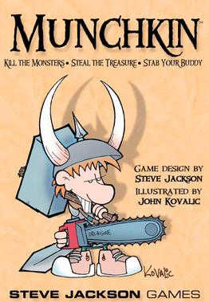

## Description



This repository is an implementation of the ["Munchkin"](<https://en.wikipedia.org/wiki/Munchkin_(card_game)>) card game using Nest.js framework and DDD approaches.

It is created mainly for self-educational purposes and contains a lot of overengeening, which might be not relevant for the application of this size.

## Requirements

- Node.js 12+
- MongoDB

## Stack

- Nest.js/TypeScript
- GraphQL/Appolo
- MongoDB via Mongoose
- Jest

## Installation

```bash
$ npm install
```

## Running the app

```bash
# development
$ npm run start

# watch mode
$ npm run start:dev

# production mode
$ npm run start:prod
```

## Test

```bash
# unit tests
$ npm run test

# test coverage
$ npm run test:cov
```

## License

[MIT licensed]
